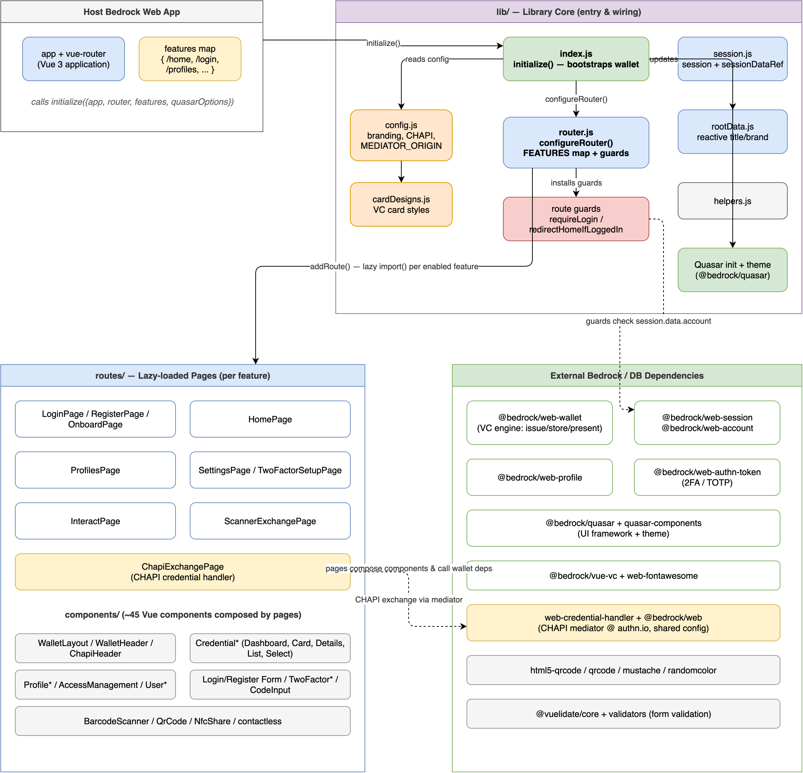

# bedrock-vue-wallet

Vue 3 + Quasar UI components for a Bedrock-based digital credential wallet.
Stores and shares [Verifiable Credentials][] and drives credential exchanges
(OID4VCI, OID4VP, and CHAPI).

## Usage

This package is a **library**, not a runnable application. It is published as
`@bedrock/vue-wallet` and consumed by a host Bedrock web app, which provides the
backend (sessions, KMS, credential store) and the peer dependencies listed in
`package.json` (`vue`, `vue-router`, `@bedrock/quasar`, `@bedrock/web-wallet`,
etc.).

The host app wires the wallet in via the `initialize()` export:

```js
import {initialize} from '@bedrock/vue-wallet';

await initialize({app, router /*, features, quasarOptions */});
```

## Architecture

`initialize()` wires the library into a host app: it configures Quasar, session
and branding, and a feature-keyed router that lazily loads page routes, which in
turn compose the wallet components. The diagram below shows how the host app,
the `lib/` core, the lazy-loaded `routes/`, and the external Bedrock
dependencies fit together.



The diagram is editable: open
[`docs/bedrock-vue-wallet-architecture.drawio`](docs/bedrock-vue-wallet-architecture.drawio)
in [draw.io](https://www.drawio.com/) (or the draw.io editor extension) and
re-export the PNG after changes.

[Verifiable Credentials]: https://www.w3.org/TR/vc-data-model-2.0/
